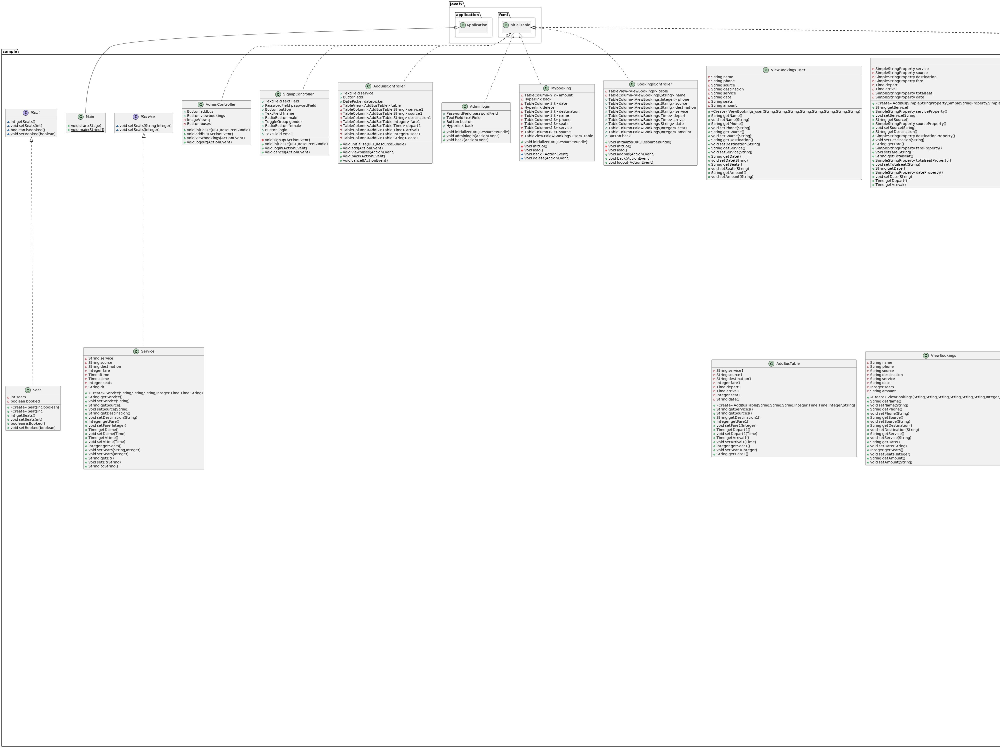

# Maze Runner Game Documentation!

**Project for Technical University of Munich**

## Table of Contents

1. Project Overview
2. Game Features
3. Technical Implementation
    - Player Mechanics 
    - Enemy AI and Pathfinding 
    - Level Design and Map Features 
    - Power-Ups and Bonuses 
4. Scoring and Bonus Points 
5. Development and Design Principles
6. Future Work and Extensions 
7. Appendix: Code Snippets 

---

## Project Overview

_Maze Runner_ is an immersive 2D puzzle game targeting players who enjoy strategic thinking and problem-solving in a dynamic environment. The game sets the player in a maze filled with various challenges, including obstacles, enemies, and puzzles. The primary objective is to find the exit of each level while collecting items and avoiding or outsmarting enemies. The game is designed to offer a balance of challenge and enjoyment, suitable for a wide range of players.

---

## Game Features

- **Dynamic Levels**: The levels are procedurally generated, ensuring a different layout and experience in each play-through. The algorithm ensures that each maze is solvable while presenting unique challenges.
- **Player Mechanics**: The player character can move in four directions, jump over obstacles, and has the ability to interact with different elements (keys, doors, items). The control scheme is intuitive, making the game accessible to players of all skill levels.
- **Enemy AI and Pathfinding** (Under Development): The enemies in the game use the A* pathfinding algorithm to track and follow the player, adding a level of challenge and requiring the player to think strategically to evade them.
- **Power-Ups and Bonuses**: Includes items that temporarily increase the player's speed, provide invulnerability, or reveal parts of the map. These power-ups add an extra layer of strategy and can help players in difficult situations.
- **Scoring System**: The game includes a scoring system based on several factors, such as the time taken to complete a level, the number of coins collected, and the number of enemies evaded or defeated.

---

## Technical Implementation

### Player Mechanics

Discuss the implementation of player m# Maze Runner Game Documentation

**Project for Technical University of Munich**

## Technical Implementation

### Player Mechanics

The implementation of player movement in Maze Runner utilizes advanced physics and control mechanics. The game leverages popular libraries and frameworks to ensure smooth and responsive player interactions. Collision detection is a critical aspect, particularly in managing interactions with maze walls, various items, and enemies.

### Enemy AI and Pathfinding

The game's AI utilizes the A* pathfinding algorithm to enable enemies to intelligently navigate the maze and pursue the player. This section discusses how the game's maze is transformed into a grid system for efficient pathfinding and how enemy movements are optimized for real-time gameplay.

### Level Design and Map Features

This section delves into the procedural generation algorithm used for creating the mazes. It explains the use of different tile types for diverse and engaging level designs and discusses the logic behind the placement of keys, doors, and power-ups.

### Power-Ups and Bonuses

Here, the various power-ups available in the game are described, along with their effects and how they influence gameplay strategies. The section also covers how these power-ups are distributed across the maze and how their placement impacts the game's dynamics.

## Development and Design Principles

The architecture of Maze Runner is a testament to the robust and scalable application of both Object-Oriented Programming (OOP) and Functional Programming (FP) principles. These programming paradigms are instrumental in crafting a game that is not only functionally rich but also easy to maintain and extend.

Object-Oriented Programming (OOP) in Maze Runner
Encapsulation and Modularity: Each element of the game, whether it's a player, enemy, or power-up, is encapsulated as an object with its attributes and behaviors. This modularity makes the code more manageable, enabling easier debugging and testing.

Inheritance and Polymorphism: To minimize code redundancy, Maze Runner utilizes inheritance. For instance, different enemy types might extend a base Enemy class. Polymorphism allows for flexibility in adding new features or enemy behaviors without altering the existing code structure significantly.

Design Patterns:

MVC (Model-View-Controller): This pattern is particularly evident in how the game separates the logic (model), UI (view), and the control (controller). This separation ensures that changes in the game logic don’t directly affect the UI, and vice versa.
Singleton Pattern: Used in managing global game states and configurations, ensuring that there is a single instance of game settings or audio management accessible throughout the game.
Functional Programming (FP) in Maze Runner
Immutable Data Structures: FP's principle of immutability is applied in Maze Runner's level design. Each level, once generated, remains unaltered during gameplay, ensuring a consistent game state and preventing unexpected side effects.

Pure Functions: Functions that calculate scores, enemy paths, or power-up effects are designed to be pure. They depend only on their input parameters, making these calculations predictable and testable.

Higher-Order Functions and Lambda Expressions: These are extensively used for operations like filtering or mapping over collections (e.g., applying an effect to all collected items). This approach leads to more concise and readable code.

State and Side Effects Management: Although FP emphasizes minimal side effects, a game naturally involves state changes (like player movement or score updates). Maze Runner strategically manages these through controlled state mutations, ensuring that they are predictable and do not introduce bugs.

Functional Reactive Programming (FRP): This paradigm, combining FP and reactive programming, is employed for handling user inputs and game events. It allows Maze Runner to react to player actions or game triggers seamlessly, enhancing the overall gameplay experience.

Combined Benefits
Scalability: By adhering to OOP and FP principles, Maze Runner is structured in a way that facilitates easy addition of new features, levels, or gameplay mechanics.
Maintainability: The clear separation of concerns, along with modular and declarative code, makes the game more maintainable. Updates or bug fixes can be implemented with minimal impact on other parts of the code.
Testability: The use of pure functions and a clear separation between logic and state make the game components more testable, leading to a more stable and reliable game.
Performance: Efficient state management, combined with FP’s lazy evaluation in parts of the game, leads to optimized performance, crucial for maintaining fluid gameplay.
In conclusion, the blend of OOP and FP in Maze Runner not only contributes to a well-organized and efficient codebase but also significantly enhances the game development process, from initial design to future expansions.

# UML

## Future Work and Extensions

- Work on VR
- Complete AI enemies
- Cross-platform support
---

## Scoring and Bonus Points
 
The AI pahtfinding, game collectables, custom ui, and character selection are considered as a bonus.

---
## References
https://libgdx.com/wiki/
https://happycoding.io/tutorials/libgdx/pathfinding
https://gamedev.stackexchange.com/questions/148497/2d-collision-detection-libgdx
---